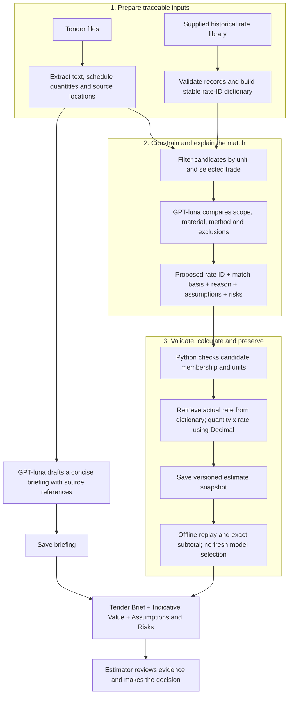
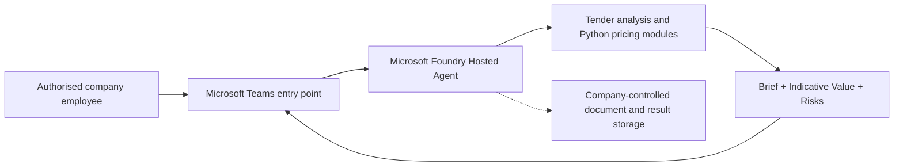

# Schick Tender Assistant

Draft Tender Brief + Python-calculated indicative value + assumptions and risks,
for an estimator to review. Final target: Microsoft Foundry, then internal Teams access.
The hosted `main.py` is still the original sample entry point; the demo pipeline is
not yet wired into that hosted endpoint.

## The problem we solve

Tender information is spread across documents, revisions, specifications and
spreadsheets. An estimator must find the relevant scope, locate comparable historical
work, understand what the historical price includes, and explain an initial value.
Asking a model to perform this entire task in one response can produce inconsistent
rate selections, unsupported prices and amounts that are difficult to reproduce.

This prototype separates **document understanding, rate-selection judgement and
numerical calculation**, and preserves the evidence connecting them. Its intended
value is to save an estimator 30–60 minutes of initial review, not replace their
Tender Management Report or make the tender decision. Time saved remains a pilot
acceptance target, not a measured outcome.

**GPT-luna interprets and recommends; Python validates and calculates; the estimator decides.**

In this README, **GPT-luna** names the model used for the language tasks. Runtime
configuration retains the actual Azure deployment identifier (currently
`gpt-5.6-luna`); this documentation label does not rename that deployment.

## Architecture: from documents to a defensible indicative value



### How historical prices are matched — not invented

1. **Extract before interpreting.** Python inventories source files and records
   fingerprints. Excel extraction retains sheet, row, cell, quantity and unit;
   text extraction retains page or paragraph locations. Missing quantities,
   unsupported formulas and special pricing items are flagged rather than silently
   converted to zero. Supported simple quantity formulas are calculated in Python.
2. **Build a price dictionary from supplied historical records.** Each validated
   record includes trade, description, unit, rate, project and notes. Python gives
   it a content-based `rate_id`, collapses identical duplicates and sorts the
   catalog. Equivalent decimal representations share an ID; a changed rate or
   project produces a different ID. This prototype loads an existing curated
   library; it does not yet automatically curate historical quotes into that library.
3. **Narrow the choice before the model sees it.** The matching command filters by
   unit and an explicitly selected trade. Optional cross-trade matching broadens
   the trade search, not unit compatibility. The repository also has an exact-text
   matching utility, but the current semantic CLI does not automatically run an
   exact-match-first cascade. Similar wording need not mean identical scope.
4. **Ask GPT-luna to select an ID, not write a price.** Candidate descriptions,
   units, project context and notes are supplied; candidate numerical rates are
   omitted from the matching request. Optional extracted specification evidence
   provides more context. The model compares scope and returns `rate_id`,
   `match_basis`, `reason`, `assumptions` and `differences`. A comparable match can
   support an indicative estimate if its limitations are explicit; unresolved
   cases remain `needs_review` or `no_suitable_candidate`.
5. **Let code retrieve and calculate.** Python rejects IDs outside the candidate
   set and validates the selected unit before retrieving the stored numerical
   rate. It computes quantity × rate and subtotals using Decimal. The model's prose
   is not the source of the reported amount. Full supply-and-place rates must not
   be casually substituted for an incremental “extra-over” item; this scope check
   relies on model instructions and estimator review, not a proven semantic rule engine.
6. **Save the selection and its explanation.** Versioned snapshots preserve the
   source item, selected historical record, recommendation, assumptions, risks,
   model/prompt context and calculated value. Batch processing can select explicit
   snapshot versions rather than silently replacing an earlier recommendation.

### Managing model variability: repeatable results without false guarantees

| Control implemented | What it achieves | What it does not guarantee |
| --- | --- | --- |
| Stable rate IDs and sorted candidates | Consistent identity and ordering for unchanged historical records | The same model judgement on every fresh request |
| Unit/trade filters and supplied-ID validation | A bounded selection from actual records; no invented rate ID enters calculation | That every remaining candidate is commercially suitable |
| Explicit matching criteria and tie-break instruction | Guides consistent comparisons and explanation of ambiguity | A deterministic model selection; the tie-break is prompt guidance |
| Structured summary output and validated matching response fields | Checks response shape and source/candidate identifiers | Truth of a narrative claim or completeness of document review |
| Saved, versioned recommendations | Reuses the exact selected rate, rationale and risks without calling GPT-luna again | That a later re-analysis with new evidence will select the same rate |
| Decimal arithmetic and offline replay | Same saved inputs and calculation rules produce the same numerical result | Correct assumptions, market prices or final commercial approval |
| File fingerprints and snapshot checksums | Detects mismatched versions or accidental changes; supports traceability | Cryptographic approval, access control or a tamper-proof audit trail |

**The key distinction:** a fresh GPT-luna analysis can vary. A report regenerated
from the same saved briefing and validated estimate snapshots does not make fresh
model decisions. Improved evidence can justify a new version; it should not erase
the earlier estimating basis. Standalone replay uses saved inputs, while batch
processing additionally compares selected snapshots with the current prepared rows.

### Explainable support for decision-making

The report lets an estimator ask **“Why this rate, from which project, for which
scope, with what uncertainty?”** Each priced item links the schedule quantity to
the historical record, calculation, match basis and saved explanation. Reasoning
here means a concise evidence-based rationale for review, not access to the model's
internal reasoning or proof that its recommendation is correct.

The briefing highlights risks, QA/compliance requirements, contract observations
and actionable information gaps. The estimator can then check inclusions, resolve
missing information and decide which assumptions to accept or revise. The current
prototype records **Pending review**; a formal approval workflow and automated
bid/no-bid decision engine are not implemented. Unpriced work stays visible as a
gap, not a zero-value conclusion.

### Responsibilities and controls

| Component | Responsibility | Boundary |
| --- | --- | --- |
| Document and schedule processing | Preserve source locations, file fingerprints and quantities; flag unsupported or missing data | Extraction is not proof that the entire tender has been reviewed |
| GPT-luna | Draft the briefing and recommend historical rate matches, with reasons and risks | Does not supply the authoritative rate amount or calculate the reported valuation |
| Python pricing | Retrieve rates from the library, validate inputs, multiply and sum using Decimal | Comparable rates remain indicative; calculation accuracy does not establish commercial suitability |
| Saved results | Preserve the selected inputs, model recommendations and calculation results | Offline replay is repeatable; a fresh model run may recommend a different rate |
| Reporting | Combine the seven-part briefing, calculation breakdown, trade allocation and assumptions | A review aid, not a final quotation, populated spreadsheet or completed Tender Management Report |
| Estimator | Check evidence, resolve gaps and decide what to use | Final judgement stays with a person |

The seven briefing sections are: tender summary; key project information; initial
risks and assumptions; QA and compliance requirements; contract observations;
high-level work by trade; and questions for the estimator.

### Current prototype versus target deployment

**Working today:** local commands call the company's GPT-luna deployment for text work
and rate recommendations. Python performs calculations and builds an English HTML
report from saved results. The demo uses selected documents and priced items, not
a complete tender valuation. Unpriced or unassessed work is not treated as zero.

**Delivery path**



Before internal release, the demo modules must be connected to the hosted entry
point, local-only paths replaced with controlled storage, and Teams integration,
company authentication, access permissions and monitoring configured and tested.
This diagram is the intended architecture, not a claim that Teams publishing is
already available in this project.

**Future work, not current functionality:** preliminary construction sequencing;
duration and time-phased forecasts; and revenue/TVC/TP calculations once the
company's definitions and required cost/resource inputs are agreed. These do not
replace the current Brief + Indicative Value deliverable.

## Code layout and local development

The service stays at `src/agent-framework-agent-basic-responses` so the existing
Foundry and Docker configuration remains valid. Its code is now organized into:

```text
src/agent-framework-agent-basic-responses/
├── main.py                     # Existing Foundry entry point
├── tender_assistant/
│   ├── pricing/                # Decimal calculation, rates, matching validation, snapshots
│   ├── text/                   # Document text extraction and GPT-luna summaries
│   ├── schedules/              # Excel schedule extraction, classification, quantities
│   ├── documents/              # Document inventory and file fingerprints
│   ├── reporting/              # Combined HTML report and standalone brief
│   ├── cli/                    # Matching/batch commands and inspection utilities
│   └── paths.py                # Stable service root for .env and saved outputs
├── tests/                      # Unit and command-line regression tests
├── pyproject.toml
├── uv.lock
└── Dockerfile
```

Run commands from the service folder with its virtual environment active:

```sh
cd src/agent-framework-agent-basic-responses
source .venv/bin/activate
python -m unittest discover -s tests -v
python -m tender_assistant.cli.match_rates --help
python -m tender_assistant.cli.match_rates --replay outputs/matches/row-105-v1.json
python -m tender_assistant.reporting.demo outputs/batches/BATCH_FILE.json --summary outputs/summaries/estimator-brief-v1.json --output outputs/reports/demo-new.html
```

Replace `BATCH_FILE.json` with an existing saved batch. Rendering and replay are
offline. Existing snapshots and output paths remain valid; existing output files
are never overwritten. No dependencies or model prompts changed in this reorganization.

### Old command → new command

| Previous script | New module command (`python -m ...`) |
| --- | --- |
| `try_rate_matching.py` | `tender_assistant.cli.match_rates` |
| `batch_rate_matching.py` | `tender_assistant.cli.batch_rates` |
| `tender_text.py` | `tender_assistant.text.extraction` |
| `tender_summary.py` | `tender_assistant.text.summary` |
| `demo_report.py` | `tender_assistant.reporting.demo` |
| `estimator_brief.py` | `tender_assistant.reporting.estimator_brief` |
| `document_inventory.py` | `tender_assistant.documents.inventory` |
| `inspect_schedules.py` | `tender_assistant.cli.inspect_schedules` |
| `compare_schedules.py` | `tender_assistant.cli.compare_schedules` |

Use modules, not `python tender_assistant/.../file.py`. For a single test module,
use `python -m unittest tests.test_pricing_engine -v`. Direct Python imports now
use package paths, e.g. `from tender_assistant.pricing.engine import calculate_item_value`.
The two schedule inspection utilities still use the original local sample paths.

Keep `.env`, tender inputs, historical rate files and generated `outputs/` local
and out of Git. The section below is retained starter documentation, not an
instruction to reinitialize or provision this existing project.

## Original hosted-agent starter reference

A minimal [Agent Framework](https://github.com/microsoft/agent-framework) agent hosted on Microsoft Foundry using the **Responses protocol**. This sample demonstrates basic request/response interaction and multi-turn conversations.

## How it works

The agent uses `FoundryChatClient` from the Agent Framework and is served via `ResponsesHostServer`, which exposes a REST API compatible with the OpenAI Responses protocol. See [main.py](src/agent-framework-agent-basic-responses/main.py) for the implementation.

## Option 1: Azure Developer CLI (`azd`)

<details>
<summary><strong>Show steps</strong></summary>

### Prerequisites

1. **Azure Developer CLI (`azd`)** — [Install azd](https://learn.microsoft.com/en-us/azure/developer/azure-developer-cli/install-azd)
2. Install the AI agent extension:
   ```bash
   azd ext install microsoft.foundry
   ```
3. Authenticate:
   ```bash
   azd auth login
   ```

### Initialize the agent project

No cloning required. Create a new folder and initialize from the manifest:

```bash
mkdir my-basic-agent && cd my-basic-agent

azd ai agent init -m https://github.com/microsoft-foundry/foundry-samples/blob/main/samples/python/hosted-agents/agent-framework/responses/01-basic/azure.yaml
```

Follow the prompts to configure your Foundry project and model deployment. If you don't have an existing Foundry project, `azd ai agent init` will guide you through creating one.

### Provision Azure resources (if needed)

If you don't already have a Foundry project and model deployment:

```bash
azd provision
```

### Run the agent locally

```bash
azd ai agent run
```

The agent host will start on `http://localhost:8088`.

### Invoke the local agent

In a separate terminal, from the project directory:

```bash
azd ai agent invoke --local "Hi"
```

### Deploy to Foundry

Once tested locally, deploy to Microsoft Foundry:

```bash
azd deploy
```

For the full deployment guide, see [Deploy a hosted agent](https://learn.microsoft.com/en-us/azure/foundry/agents/how-to/deploy-hosted-agent).

### Invoke the deployed agent

```bash
azd ai agent invoke "Hi"
```

</details>

## Option 2: VS Code (Foundry Toolkit)

### Prerequisites

1. **VS Code** with the **[Foundry Toolkit](https://marketplace.visualstudio.com/items?itemName=ms-windows-ai-studio.windows-ai-studio)** extension installed.
2. For debugging Python in VS Code, install the **[Python](https://marketplace.visualstudio.com/items?itemName=ms-python.python)** extension pack.

### Set up the Python virtual environment

- With Python 3.13 or later and [pipx](https://pipx.pypa.io/stable/installation/), install uv outside the project environment, then let uv create and synchronize the locked environment:

  ```bash
   pipx install uv==0.11.7
   uv sync --frozen --python 3.13
  ```
- Open the Command Palette (`Ctrl+Shift+P`), run **Python: Select Interpreter**, and select the `.venv` created by uv.

### Run and debug the agent

Press **F5** to start the agent. The agent starts and the **Agent Inspector** opens automatically. Chat with the agent in the Inspector.

### Or run manually, then open the Inspector

1. Set the required environment variables and sign in to Azure with the Azure CLI (`az login`).
2. Start the agent: `uv run --no-sync python main.py` (listens on `http://localhost:8088`).
3. Command Palette (`Ctrl+Shift+P`) → **Foundry Toolkit: Open Agent Inspector**, then send a message to test.

### Deploy to Foundry

1. Open the Command Palette (`Ctrl+Shift+P`) and run **Foundry Toolkit: Deploy Hosted Agent**. The extension opens a **Deploy Hosted Agent** wizard and reads `agent.yaml` to auto-populate settings.
2. If prompted, complete **Foundry Project Setup** to select subscription and project.
3. On the **Basics** tab, choose deployment method (**Code** or **Container**) and confirm the agent name.
4. On **Review + Deploy**, confirm runtime details, pick **CPU and Memory** size, and click **Deploy**.
5. After deployment, invoke the agent in the Agent Playground and stream live logs from the **Logs** tab.

## Next steps

- [Quickstart: Create a hosted agent](https://learn.microsoft.com/en-us/azure/foundry/agents/quickstarts/quickstart-hosted-agent) — end-to-end walkthrough using `azd`
- [Tool catalog](https://learn.microsoft.com/en-us/azure/foundry/agents/concepts/tool-catalog) — browse available tools to extend your agent (Bing Search, Azure AI Search, file search, code interpreter, and more)
- [Manage hosted agents](https://learn.microsoft.com/en-us/azure/foundry/agents/how-to/manage-hosted-agent) — monitor and manage deployed agents
- [Add tools to your agent](https://github.com/microsoft-foundry/foundry-samples/tree/be4706c76acfe44e2ae99c2818efdc4c5ab25bd9/samples/python/hosted-agents/agent-framework/responses/02-tools/) — sample with local tool functions
- [Use Foundry Toolbox](https://github.com/microsoft-foundry/foundry-samples/tree/be4706c76acfe44e2ae99c2818efdc4c5ab25bd9/samples/python/hosted-agents/agent-framework/responses/04-foundry-toolbox/) — sample with Azure Foundry Toolbox integration
